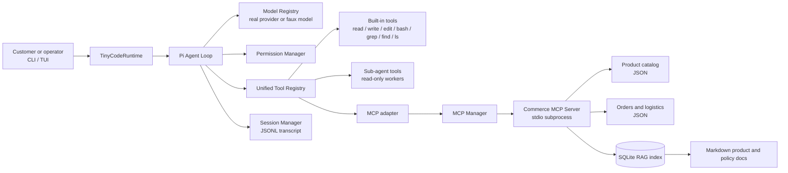
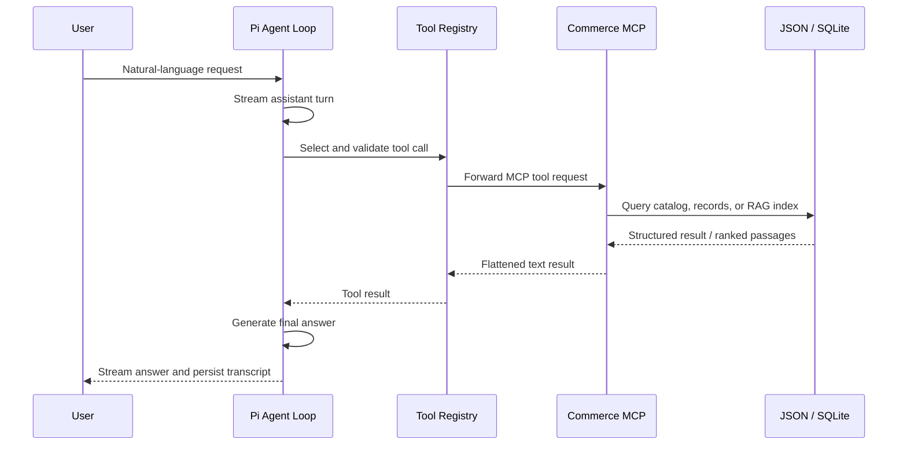

<<<<<<< HEAD
# TinyCode Commerce

> A readable, production-minded commerce customer-service Agent harness built on **Pi Runtime**.

[](./LICENSE)
[](./package.json)
[](./tsconfig.json)
[](./tests)

TinyCode Commerce is an educational yet runnable AI agent harness for commerce customer service and operations. It combines a streaming agent loop, policy-controlled tools, MCP integrations, local RAG retrieval, session persistence, skills, and supervised read-only sub-agents in a small TypeScript codebase.

The project is intentionally **data-source agnostic**: it does not ship with real customer, order, or product records. You provide your own JSON and Markdown data through configuration or environment variables.

## Why this project exists

Most AI agent projects hide the important parts behind a framework call. TinyCode Commerce makes those parts visible:

- how a model response becomes a tool call;
- how tool calls are validated and permission-checked;
- how external MCP tools join the same registry as built-in tools;
- how local commerce knowledge is retrieved with BM25 or hybrid search;
- how transcripts are persisted and resumed;
- how deterministic tests exercise the real agent loop without an API key.

It is suitable for learning agent architecture, prototyping commerce workflows, and serving as a foundation for a domain-specific customer-service assistant.

## Highlights

- **Pi-powered agent loop** — streaming responses, tool execution, lifecycle events, aborts, and continuations are provided by `@earendil-works/pi-agent-core`.
- **Commerce MCP server** — exposes product, order, logistics, and knowledge-search operations over MCP stdio transport.
- **Local RAG** — ingests Markdown documents into SQLite and supports lexical BM25 retrieval; configured embedding providers can add hybrid retrieval.
- **Unified tool registry** — built-in tools, MCP tools, and sub-agent tools are presented to the model through one interface.
- **Permission gate** — every tool call passes through a workspace-aware permission policy; unattended mode must be explicit.
- **Session persistence** — append-only JSONL transcripts support resume and inspection.
- **Progressive-disclosure skills** — skill summaries are advertised first, with full instructions loaded only when needed.
- **Offline-first testing** — a deterministic faux model drives real tool calls and MCP subprocesses without network access.
- **Readable architecture** — small modules, explicit boundaries, TypeScript types, and executable integration tests.

## Architecture



### Request lifecycle



## Repository layout

```text
.
├── src/
│   ├── agent/          # Pi Agent wrapper and runtime policies
│   ├── agents/         # supervised read-only sub-agents
│   ├── commerce/       # commerce service, catalog, RAG, MCP server
│   ├── config/         # config schema and loading
│   ├── context/        # truncation, artifacts, and compaction
│   ├── mcp/            # MCP client, lifecycle manager, adapter
│   ├── model/          # provider registry and offline faux model
│   ├── permissions/    # approval and command-risk policy
│   ├── session/        # JSONL session persistence
│   ├── skills/         # progressive-disclosure skill registry
│   ├── tools/          # built-in tool implementations
│   └── tui/             # terminal UI
├── tests/               # unit, integration, E2E, CLI, and TUI tests
├── .tinycode/
│   ├── config.example.json
│   └── skills/          # project-local skills
├── ARCHITECTURE.md      # deeper design notes
├── package.json
└── README.md
```

## Requirements

- Node.js **22.19 or newer**
- npm
- An API key for a real provider (optional)
- No external service is required for the offline Mock mode

## Quick start

```bash
git clone https://github.com/<your-account>/tinycode-commerce.git
cd tinycode-commerce
npm install
npm run build
```

### Run with the offline model

Mock mode is deterministic and requires no API key:

```bash
TINYCODE_MODEL=mock npm run dev
```

On Windows PowerShell:

```powershell
$env:TINYCODE_MODEL = "mock"
npm run dev
```

### Run with a real provider

API keys are read from environment variables and should not be committed:

```bash
# macOS / Linux / Git Bash
export ANTHROPIC_API_KEY=your-key
npm run dev

# Select a configured model explicitly when needed
TINYCODE_MODEL=anthropic/claude-sonnet-4 npm run dev
```

The exact provider/model identifiers depend on the Pi model catalog and your configuration.

### One-shot mode

```bash
npx tinycode -p "describe this project"
npx tinycode -p "inspect the order workflow" --permission-mode ask
npx tinycode -p "apply the requested refactor" --permission-mode auto
```

Headless mode has no interactive approval dialog. In `ask` mode, operations requiring approval are denied safely; use `--permission-mode auto` only in a controlled environment.

## Commerce MCP integration

The commerce server is an MCP stdio server. TinyCode starts it as a child process, discovers its tools, and adapts those tools into the normal Agent tool registry.

### Build and ingest knowledge

```bash
npm run build
npm run commerce:ingest -- \
  --knowledge ./data/knowledge \
  --db ./data/commerce.sqlite
```

The knowledge directory can contain ordinary Markdown files:

```text
data/
├── knowledge/
│   ├── return-policy.md
│   ├── shipping-faq.md
│   └── product-care.md
├── products.json
├── orders.json
├── logistics.json
└── commerce.sqlite
```

### Configure `.tinycode/config.json`

Start from [`.tinycode/config.example.json`](./.tinycode/config.example.json), then configure the MCP server:

```json
{
  "provider": "mock",
  "permissionMode": "ask",
  "mcpServers": {
    "commerce": {
      "command": "node",
      "args": ["dist/commerce/mcp-server.js"],
      "timeoutMs": 30000,
      "env": {
        "TINYCODE_COMMERCE_PRODUCTS": "./data/products.json",
        "TINYCODE_COMMERCE_ORDERS": "./data/orders.json",
        "TINYCODE_COMMERCE_LOGISTICS": "./data/logistics.json",
        "TINYCODE_COMMERCE_RAG_DB": "./data/commerce.sqlite",
        "TINYCODE_COMMERCE_KNOWLEDGE_DIR": "./data/knowledge"
      }
    }
  }
}
```

Paths are resolved by the spawned process. For portable deployments, prefer absolute paths or verify the configured working directory.

### Exposed MCP tools

| Tool | Purpose | Input |
|---|---|---|
| `get_product_detail` | Fetch one structured product record | `product_id` |
| `search_products` | Search structured product records | `query` |
| `get_order_detail` | Fetch an order record | `order_id` |
| `get_logistics_status` | Fetch the latest logistics record | `order_id` |
| `search_product_knowledge` | Search product and policy documents | `query`, optional `top_k` |

The MCP adapter normalizes remote JSON Schemas and flattens text content into model-friendly tool results. A failed MCP server is recorded as an error state rather than crashing the entire harness.

## Commerce data formats

### Products

`products.json` must be a JSON array. Each record requires `id`, `title`, `description`, `price`, and `stock`:

```json
[
  {
    "id": "p-001",
    "title": "轻薄羽绒服",
    "description": "适合冬季通勤的轻量保暖外套",
    "price": 399,
    "stock": 8
  }
]
```

### Orders

`orders.json` is an array of objects with an `id` field. Additional fields are preserved:

```json
[
  {
    "id": "ORD001",
    "status": "shipped",
    "total": 399,
    "customer_note": "请工作日派送"
  }
]
```

### Logistics

`logistics.json` is an array of objects with an `order_id` field:

```json
[
  {
    "order_id": "ORD001",
    "status": "派送中",
    "tracking_number": "SF001"
  }
]
```

### Knowledge documents

Knowledge files are Markdown. Their filename is used as the document source and they are indexed under the `commerce` scope:

```markdown
# 退换货政策

商品签收后七天内支持退换货。保持商品及包装完整，并提供有效订单信息。
```

Do not place personal data, access tokens, or production exports in the repository. Use a private data directory and local environment configuration instead.

## RAG behavior

The RAG layer is deliberately simple and inspectable:

1. Markdown files are split and ingested into the configured SQLite database.
2. Queries use scoped lexical retrieval with BM25-style ranking.
3. If a supported embedding key is configured, the service can use hybrid lexical/vector retrieval.
4. Results are returned with source metadata so an agent can explain where a policy answer came from.
5. Retrieval remains available without an embedding key through the lexical fallback.

The MCP server starts synchronously for protocol availability, while optional embedding preparation is handled asynchronously. This keeps startup resilient when embeddings are unavailable.

## Permissions and safety

TinyCode's permission manager is an approval policy and workspace boundary, **not an operating-system sandbox**.

- File tools use canonical paths and protect the configured project boundary.
- Writes, installs, and risky shell commands can require approval.
- Headless `ask` mode denies operations that cannot be approved interactively.
- `auto` mode is intended for trusted local test or CI environments only.
- An approved shell command still has the privileges of the current user.
- Run untrusted tasks inside an external container, VM, or sandbox.
- Keep API keys in environment variables; do not put them in committed JSON.

## Testing and quality checks

The suite is designed to run offline:

```bash
npm test
npm run typecheck
npm run lint
npm run build
```

The commerce E2E tests exercise the real integration path:

- a deterministic faux model emits MCP tool calls;
- a genuine MCP stdio subprocess is started;
- order and logistics data are read from temporary JSON fixtures;
- policy content is retrieved from a temporary local RAG database;
- the final assistant response is asserted.

This is intentionally different from mocking the service method directly: it verifies the Agent loop, tool schema, MCP transport, adapter, and data service together.

## Configuration reference

| Setting | Description | Default |
|---|---|---|
| `provider` | Model provider name | first available configured provider |
| `model` | Provider model identifier | provider default |
| `maxOutputTokens` | Per-request output cap | `16384` in the harness |
| `permissionMode` | `ask` or `auto` | `ask` |
| `context.compactAboveTokens` | Context compaction threshold | model-dependent |
| `context.keepRecentMessages` | Recent messages protected during compaction | `12` |
| `mcpServers` | Named MCP stdio server definitions | `{}` |
| `TINYCODE_MODEL` | Environment override, including `mock` | unset |
| `TINYCODE_PERMISSION_MODE` | Environment permission override | unset |
| `TINYCODE_HOME` | Redirects TinyCode's data directory | platform default |

## Development commands

```bash
npm run dev              # launch the interactive TUI
npm run build            # compile TypeScript into dist/
npm run typecheck        # strict type checking without emitting
npm run lint             # run ESLint
npm test                 # run the full Vitest suite
npm run test:watch       # watch tests during development
npm run commerce:mcp     # run the commerce MCP server directly
npm run commerce:ingest  # create or update a local knowledge index
```

Useful slash commands in the TUI include `/help`, `/new`, `/resume`, `/sessions`, `/model`, `/skills`, `/mcp`, `/agents`, `/compact`, `/status`, and `/exit`.

## Documentation guide

- [`ARCHITECTURE.md`](./ARCHITECTURE.md) — module map, ownership boundaries, and data flow.
- [`src/agent/runtime.ts`](./src/agent/runtime.ts) — how TinyCode policies attach to Pi's Agent.
- [`src/mcp/client.ts`](./src/mcp/client.ts) — MCP lifecycle and failure isolation.
- [`src/mcp/adapter.ts`](./src/mcp/adapter.ts) — mapping remote tools into the unified registry.
- [`src/commerce/service.ts`](./src/commerce/service.ts) — catalog, records, and RAG service boundary.
- [`tests/harness.e2e.test.ts`](./tests/harness.e2e.test.ts) — complete offline agent-loop example.
- [`tests/commerce-e2e.test.ts`](./tests/commerce-e2e.test.ts) — commerce MCP E2E flow.

## Design principles

### Small enough to understand

The code favors explicit composition over a large framework abstraction. Each subsystem has a narrow responsibility and can be tested independently.

### Real integration paths in tests

The most valuable tests use the real Pi loop, actual tool adapters, temporary data, and genuine MCP subprocesses. Determinism comes from the model fixture, not from replacing the system under test.

### Graceful degradation

Missing embeddings, unavailable providers, and failed optional MCP servers should produce actionable state and fallback behavior where possible. They should not silently fabricate commerce facts.

### Domain data stays outside the package

The application code defines schemas and retrieval behavior; operators own the business data. This keeps examples safe to publish and makes the harness usable with different catalogs and policies.

## Roadmap

Possible future extensions, without changing the current minimal core:

- citation-aware customer responses with source snippets;
- configurable order-status and refund-policy workflows;
- pluggable vector stores and embedding providers;
- audit exports for tool calls and permission decisions;
- evaluation fixtures for response grounding and policy compliance;
- deployment examples for containerized MCP servers.

## Contributing

Contributions are welcome. Before opening a pull request:

1. keep modules focused and interfaces explicit;
2. add or update tests for behavior changes;
3. run `npm test`, `npm run typecheck`, `npm run lint`, and `npm run build`;
4. never commit API keys, customer data, order exports, or generated private databases;
5. explain any new dependency or provider-specific behavior.

## Acknowledgements

- [Pi](https://github.com/earendil-works/pi) — the runtime foundation and model/tool contracts.
- [Model Context Protocol](https://modelcontextprotocol.io/) — the external tool integration protocol.
- [MiniCode](https://github.com/LiuMengxuan04/MiniCode) — inspiration for a learn-by-building agent harness.

## License

[MIT](./LICENSE)
